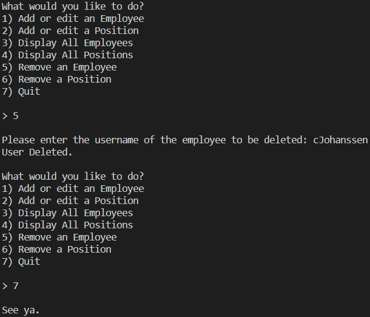
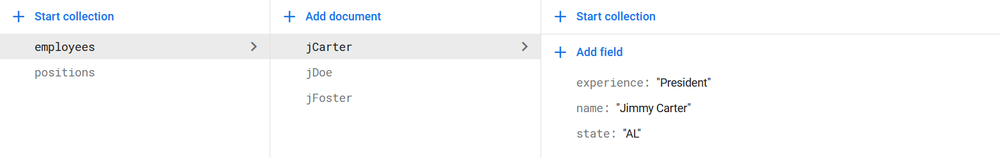

# Overview

This is a simple cloud database program. It allows the user to store/manipulate employee data, including a name, home state, and experience, as well as position data, which includes a work position title, a manager name, and an amount of pay for the position. This is stored in the cloud via Google Firebase and can be accessed and updated from multiple locations simultaneously.  
All information is stored [here.](https://console.firebase.google.com/project/employee-database-c9b7c/firestore/data~2F) You might not be able to access that. I'm not sure.  
<h2><b>Please, when creating a new user, make their user name their first initial (lower case) and their last name (first letter upper case). Ex: John Doe's password would be "jDoe".  <b></h2>

# Development Environment

* Python 3.8.5
* Visual Studio Code
* Google Firebase/Firestore

# Execution

To run: `python main.py`   
<b>Adding an Employee:</b> 

 <b>Adding a Position:</b> 

 <b>Deleting/Displaying an Employee:</b> 

 <b>The firestore collections:</b> 

# Useful Websites

1. [Python Reference](https://docs.python.org/3/genindex-I.html)
2. [Stack Overflow Python Questions](https://stackoverflow.com/questions/tagged/python)
3. [W3Schools Python Tutorial](https://www.w3schools.com/python/)
4. [Google Firebase Documents](https://firebase.google.com/docs/guides?authuser=0)